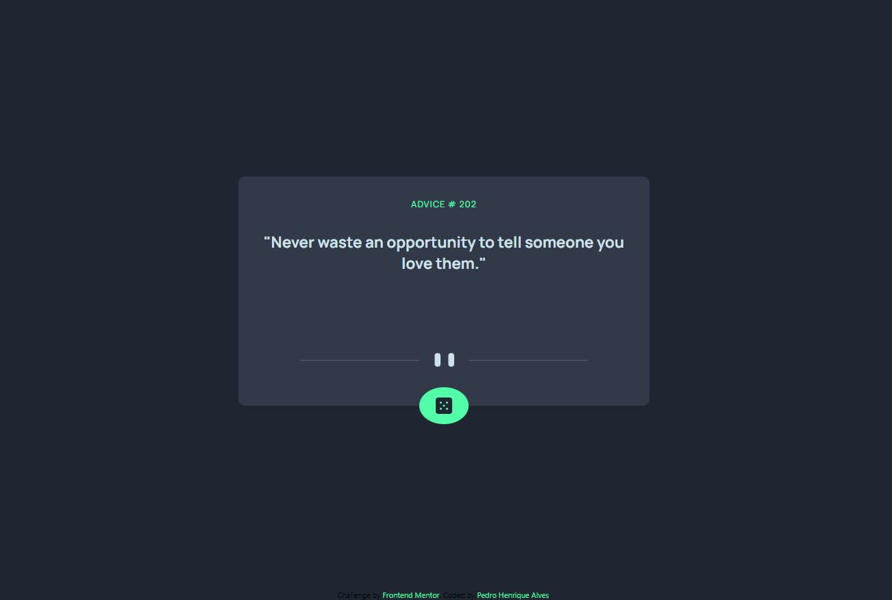

<h1 align="center"><strong>Gerador de Conselho</strong><h1>

    

# **Sobre o Projeto**
Projeto <strong>Gerador de Conselho</strong> disponibilizado por [Frontend Mentor](https://www.frontendmentor.io/home) feito utilizando  API, JavaScript, mobile first.
   
  

# **Tecnologias**
* [HTML](https://developer.mozilla.org/pt-BR/docs/Web/HTML) 
* [CSS](https://developer.mozilla.org/pt-BR/docs/Web/CSS)
* [JavaScript](https://developer.mozilla.org/pt-BR/docs/Web/JavaScript)
* [API](https://developer.mozilla.org/pt-BR/docs/Glossary/API)  

# **Status**
</img>  

# **Licença**
 </img>  

# **Autor**
<a href="https://www.linkedin.com/in/pedrohalves/">
    </img>
LinkedIn</a>  

# **Disponível**
Clique <a href="https://pedrohenriquealvesfernandes.github.io/gerador-de-conselho/" style="color: cyan"><strong>AQUI</strong></a> para acessar a projeto em funcionamento.

